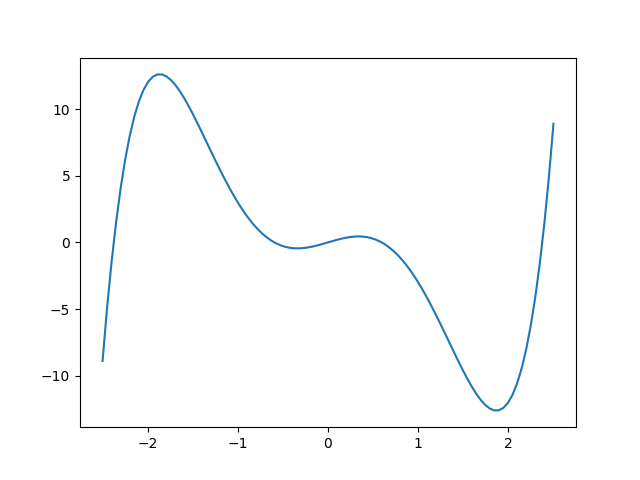
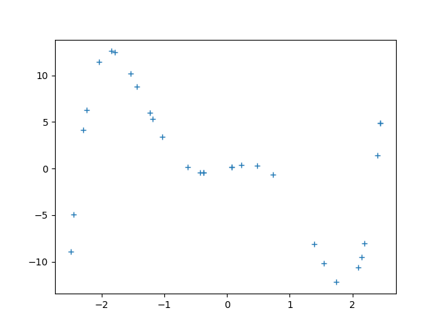
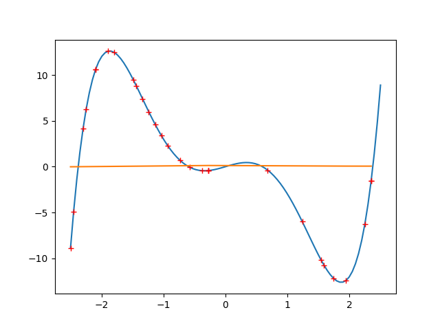
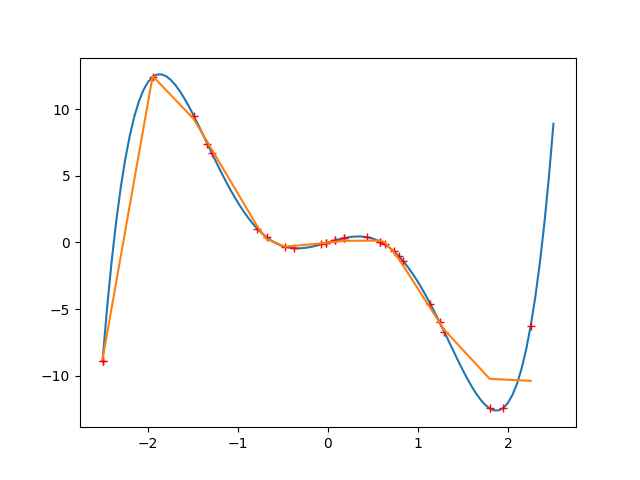
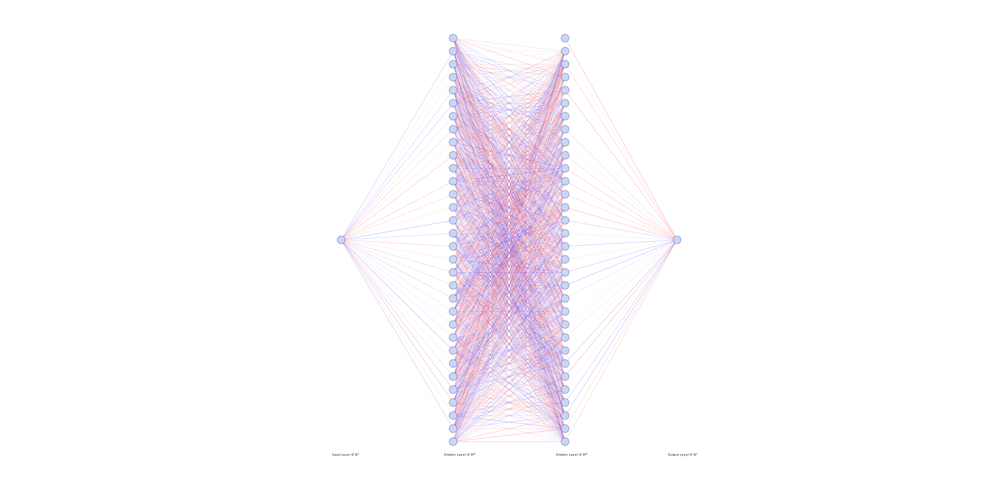
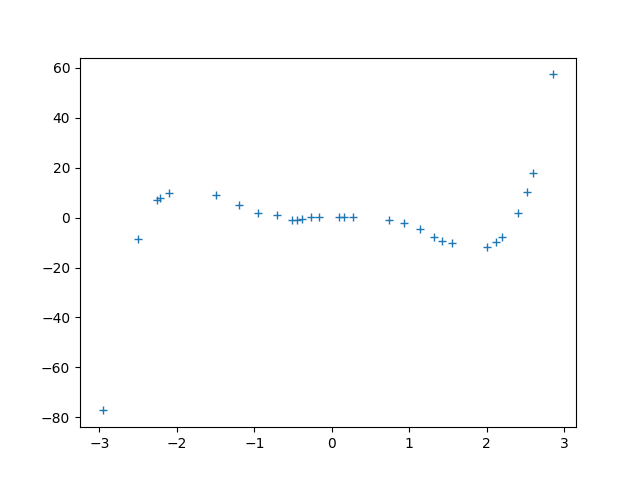
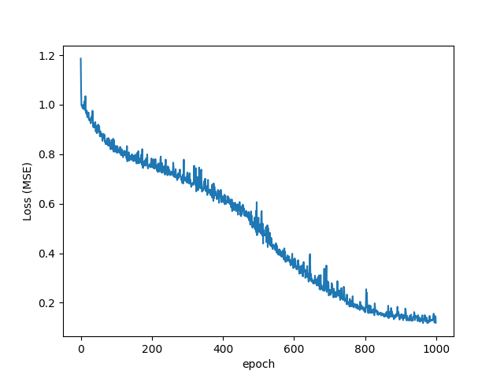
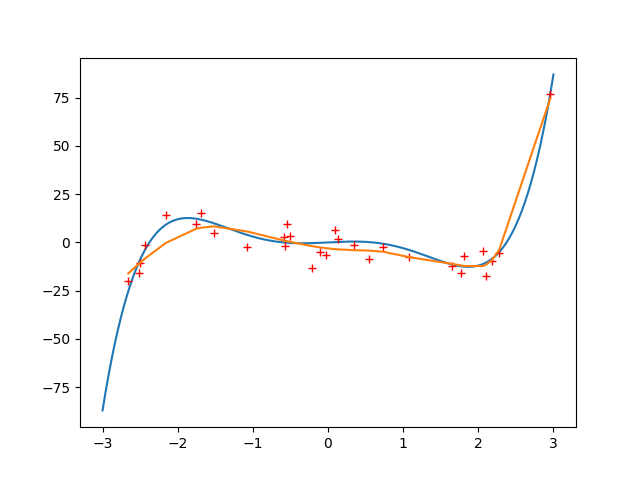
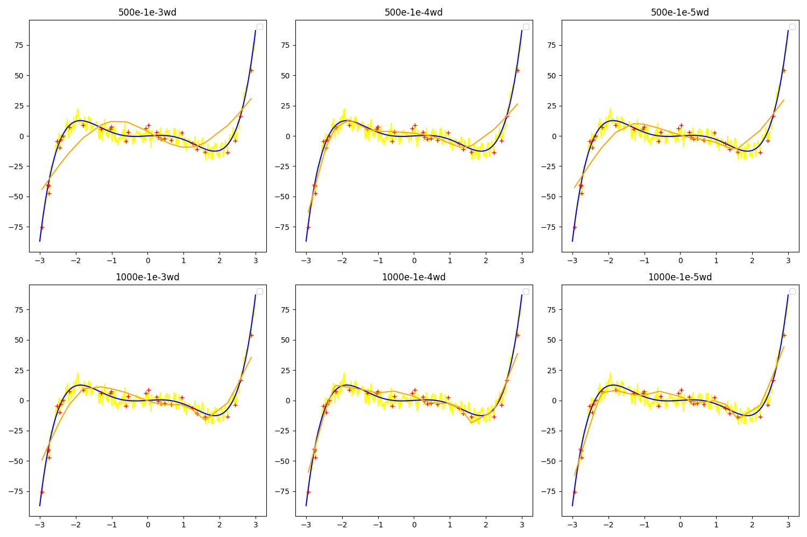
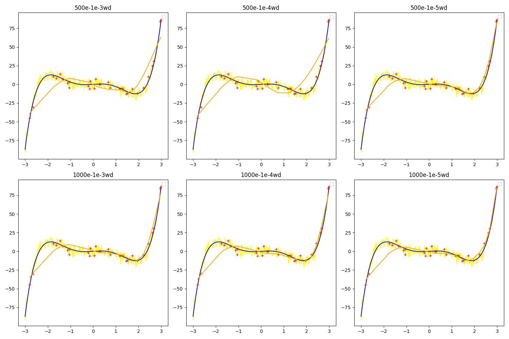

# Objective
This repository was created to really understand how to build neural networks and how to make them work properly with matplot, pytorch and numpy.

-----

# 5 Degree Function

## Mission
On the [first example](fivedegree/) of this repository, we're going to build and train a neural network capable of predicting values following the behaviour of a fifth degree math function.

### Data
Firstly, we'll define an array with _x values_ and _y values_ in [gen_data.py](fivedegree/gen_data.py) to create the target that our neural network must recreate. The following fifth degree function will be our task:

$$f(x) = x^5 - 6x^3 + 2x $$



Now, to train our neural network, it's important to choose a few samples so as it don't get overfitted, neither "easy" to understand. In our example, we'll work with **30 random samples** from **100 total samples**:



Finally, we must initiate the class of our dataset with the previous samples (now as tensors of 1 dimension) and load the data using pytorch.

```
class main_dataset(Dataset):
    def __init__(self, x_sample, y_sample):
        self.x_sample = x_sample
        self.y_sample = y_sample
    def __len__(self):
        return len(self.y_sample)
    def __getitem__(self, index):
        y_val = tt.tensor(self.y_sample[index])
        x_val = tt.tensor(self.x_sample[index])
        return {'y':y_val.unsqueeze(dim=-1), 'x':x_val.unsqueeze(dim=-1)}

data = main_dataset(x_sample,y_sample)
dataloader = DataLoader(data, batch_size=2, shuffle=True)
```

Our data is ready to be used!

## Model 

Now, with the _x samples_ and _y samples_, we'll develop our model's class. In [build_model.py](fivedegree/build_model.py), we are defining the activation function [ReLU](https://docs.pytorch.org/docs/stable/generated/torch.nn.ReLU.html):

$$ \mathrm{ReLU}(x) = \max(0, x) $$

Also, the _in & out_ layers of our neural network (2 intermediate features):

$$ y = xA^T + b $$

This linear function will be repeated 3 times for each layer of neurons. It is responsible for calculating the dot product between our _`x` features_ and _weights matrix_ $A^T$, plus a _bias_ _`b`_.

```
class main_model(nn.Module):
    def __init__(self):
        super().__init__()
        self.in_linear = nn.Linear(1,2,bias=True)
        self.relu = nn.ReLU()
        self.out_linear = nn.Linear(2,1,bias=True)
```

Lastly, inside the class, the feed forward mechanism merges all the previous data/functions by normalization ($Z$-score):

$$z = \frac{x - \mu}{\sigma}$$

on each `x` sample, inserting it in the first layer, and going throw the activation function.

```
    def forward(self,x):
        x = (x-mean)/std
        x1 = self.in_linear(x)
        x_temp = self.relu(x1)
        return self.out_linear(x_temp)

model = main_model()
```

Although our model is ready to go, there're still a couple of changes that have to be made.

### Evaluation (before training)

For educational purposes, we'll be putting our model to the test before the training. Firstly, let's change it's state to an evaluation mode, so as the inference data doesn't conflict with any sort of training data and create a list for the untrained model predictions.
```
model.eval()
y_bpredictions = list()
```
Now, the inference script comes in action. For each _x value_ selected from the _x sample values_, the model will, **without gradient (since we don't want to calculate the gradients for retropropagation)**, predict a target _y_ based on a _x_ feature; treat the tensor predicted by creating a new tensor and extracting it's value; appending it to the previous untrained model predictions list.
```
for x_feature in x_sample:

    with tt.no_grad():
        bprediction = model(tt.tensor([x_feature]))
        treated_bprediction = bprediction.detach().item()
        y_bpredictions.append(treated_bprediction)
```
As you see on the graph below: the orange line represents the results that, of course, aren't good, since the model is completely clueless of what is happening...


* Red Dots: Sample Data
* Blue Curve: Fifth Degree Function
* Orange Curve: Model Predictions

Now, our task is to train and optimize the model's parameters until it is capable of predicting the behaviour of the fifth degree function.

## Training

This is the magic part of our first example. Here the model will learn how to reproduce our fifth degree function. The first step is to instantiate our loss function.

$$ MSE = \frac{1}{n} \sum_{i=1}^{n} (y_i - \hat{y}_i)^2 $$

This function calculates the mean squared error (_MSE, Quadratic Loss or L2 Loss_) returned by our model - when comparing the data predicted to the real data.

```
loss_function = nn.MSELoss()
```

**Disclaimer:** There are many loss functions in Machine Learning; this example is just one interesting approach you can choose.

We will also set the learning rate and the number of epochs that our model will go through.
```
learning_rate = 5e-6
epochs = 10
```

Now, we will not only change our model mode to training mode, but also instantiate **the optimizer**.

```
model.train()

optimizer = tt.optim.SGD(
    model.parameters(),
    lr=learning_rate)
```

The optimizer that I've selected is the _Stochastic Gradient Descent (SGD)_, which will go through all batches of data _"giving directions"_. The picture bellow represents the effects of batch sizes and learning rates to the _SGD_'s behaviour. The arrows are directions given by our loss function which will guide ours model parameters to be more accurate.


*[Image font](https://www.researchgate.net/figure/This-figure-Shows-multi-SGD-optimizer_fig3_327135988) - This diagram doesn't show exactly how __our optimizer__ is handling our learning rate and batch size. It's merely a representation.*

Lastly, let's create the learning looping that our model will repeat for `n epochs` defined previously.

```
for epoch in range(epochs):
    
    for batch in dataloader:
        y_target_prediction = model(batch['x'])
        
        difference = loss_function(y_target_prediction, batch['y'])
        difference.backward()
        
        optimizer.step()
        optimizer.zero_grad()

    print(difference)
```
In details:
- **for batch in dataloader:**
When we previously defined our `__getitem__ ` function, the dictionary returned will be loaded by the model as a `batch`.
```
    def __getitem__(self, index):
        y_val = tt.tensor(self.y_sample[index])
        x_val = tt.tensor(self.x_sample[index])
        return {'y':y_val.unsqueeze(dim=-1), 'x':x_val.unsqueeze(dim=-1)} ---> each batch
```

- **y_target_prediction = model(batch['x'])**
Here, as we defined our `foward` function, the `batch['x']` values will be used to predict a `y_target_prediction` by executing the _"in linear function"_, the _ReLU function_ and the _"out linear function"_ over the _"x"_ feature.
```
    def forward(self,x):
        x = (x-mean)/std
        x1 = self.in_linear(x)
        x_temp = self.relu(x1)
        return self.out_linear(x_temp)
```

- **difference = loss_function(y_target_prediction, batch['y'])**
That's the function responsible for telling our model how wrong it is, `y_target_prediction`, from the real target value `batch['y']`.

- **difference.backward()**
Most known as *retropropagation*, this function calculates all the lost function gradients in relation to the trainable weights and bias of the model, then indicates how much each parameter must be ajusted for the model to have more success.

- **optimizer.step()**
The gradients obtained previously by `difference.backward()` will be applied to the model and all parameters should be updated.

- **optimizer.zero_grad()**
Because we're going through multiple batches, we can't sum all of the gradients every loop, so we turn them all to zero after updating the parameters.

- **print(difference)**
Using this line, you can clearly see the change made by the optimizer on the tensors. The terminal should show something close to the following feedback.
```
    tensor(60.3679, grad_fn=<MseLossBackward0>)
    tensor(51.5132, grad_fn=<MseLossBackward0>)
    tensor(63.8576, grad_fn=<MseLossBackward0>)
    tensor(20.4159, grad_fn=<MseLossBackward0>)
    tensor(31.5784, grad_fn=<MseLossBackward0>)
    tensor(46.8480, grad_fn=<MseLossBackward0>)
    tensor(1.9894, grad_fn=<MseLossBackward0>)
    tensor(1.9903, grad_fn=<MseLossBackward0>)
    tensor(44.5663, grad_fn=<MseLossBackward0>)
    tensor(1.9711, grad_fn=<MseLossBackward0>)
```

### Evaluation (after training)
The moment of truth has come. Now we are going to change the mode of the model to evaluation to see how did it went predicting the behaviour of the fifth degree function after training (the same way we did before training).
```
model.eval()

y_apredictions = list()

for x_feature in x_sample:

    with tt.no_grad():
        bprediction = model(tt.tensor([x_feature]))
        treated_bprediction = bprediction.detach().item()
        y_apredictions.append(treated_bprediction)
```
And the results... didn't change?



* Red Dots: Sample Data
* Blue Curve: Fifth Degree Function
* Orange Curve: Model Predictions

That's because a fifth degree function has such a complexity that our little neural network can't stand a chance. Let's change a little bit our parameters to see what happens.

## Changing Parameters

The first thing we must do is: in the architecture of the neural network, inside [build_model.py](fivedegree/build_model.py), there must be a new layer with many more neurons (for example **32 neurons**) with the activation function called between the `in, mid` and `out linears`.
```
class main_model(nn.Module):
    def __init__(self):
        super().__init__()
        self.in_linear = nn.Linear(1,32,bias=True)
        self.mid_linear = nn.Linear(32,32,bias=True)
        self.out_linear = nn.Linear(32,1,bias=True)
        self.relu = nn.ReLU()
    
    def forward(self,x):
        x = (x-mean)/std
        x1 = self.relu(self.in_linear(x))
        x2 = self.relu(self.mid_linear(x1))
        return self.out_linear(x2)
```
Then, we will change a few numbers on the optimizer values inside [train_model.py](fivedegree/train_model.py).
```
loss_function = nn.MSELoss()
learning_rate = 1e-3
epochs = 500
```
With a bigger learning rate, the model's parameters will be changed quickly and intensely. Furthermore, it will have more time to learn, since we increased the epochs to 500.

**Disclaimer:** You must keep in mind that while training bigger or smaller models for more or less complex tasks, these values and parameters should always be quite different.

### Evaluation (changing parameters)

After changing completely our _learning rate, epochs_ and _number of neurons_, the results are completely different. As we saw earlier, our optimizer is strongly affected by the architecture, learning rate and batches, so the only work we had to do was turning the _"gradient directions"_ more effective to efficiently change the model's parameters.



* Red Dots: Sample Data
* Blue Curve: Fifth Degree Function
* Orange Curve: Model Predictions

It's clear that the model could replicate most of the fifth degree function curve, which shows us that it's capable of understanding behaviours based on complex patterns. On the other hand, its size has increased considerably as you may see on diagram bellow...



_This 4 layers & 32 neurons neural network diagram was developed using the [AlexNail tool](https://alexlenail.me/NN-SVG/)._

## Setup Instructions (First Example)
To run the code and test the neural network model, start by cloning the github repository.
```
git init
git clone https://github.com/henriquegalva0/understanding-supervised-learning.git
```
Create a python environment, activate it and install all project requirements.
```
python -m venv .venv
./.venv/Scripts/Activate.ps1
pip install -r requirements.txt
```
Finally, execute the following scripts.
```
python ./fivedegree/gen_data.py
python ./fivedegree/build_model.py
python ./fivedegree/train_model.py
```

-----

# Gaussian Noise

## Mission
On the [first example](fivedegree/), we solved our task optimizing a neural network to understand the behaviour of a fifth degree function. Now, the task is quite the same, except for the fact that the data won't be so clean to read.

### Data

Even though the pattern created by selected values from a fifth degree function is quite complex to understand, if you train with clean data, eventually your model will catch up and easily recognize the pattern.

The task now is to make the learning path of our model harder. We're adding _gaussian noise_ (or white noise) to the data sample in [gen_noisy_data.py](fivedegree_gaussiannoise/gen_noisy_data.py).

$$y_{noisy} = y_{true} + \epsilon$$

The noise factor over our data will be given by random normalized values obtained from a gaussian distribution added to `y_clean`, which is the previous defined `f(x)`, but now with **300 sample values** going from `-3` to `3` to study how the noise affects the model.

$$f(x) = x^5 - 6x^3 + 2x $$

With that, the following code will be responsible for adding noise to the clean data.

```
sigma = 0.5
noise = np.random.normal(0,sigma, y_clean.shape)
y_values = y_clean + noise
```

Ultimately, we'll be selecting only **one tenth** of our full dataset for the training _(we'll be using `target_values = np.random.permutation(300)[:30]` to avoid duplicating sample values)_.

```
x_sample = x_values[target_values]
y_sample = y_values[target_values]
```



This plot of our sample data shows how little and noisy the information given to the model is right now. Now, the real mission is to study the behaviour of our model facing this problem:

* Will our model suffer from **overfitting**? In other words, will the model memorize the noise and replicate it, or will it develop a robust regression?

## Model

The archicteture used to build and train our model will be the same as in [build_model.py](fivedegree/build_model.py]) and [train_model.py](fivedegree/train_model.py]), however we'll be running a couple of experiments with the size of the neural network.

Within the file [train_model.py](fivedegree_gaussiannoise/train_model.py), the number of neurons will be changed to 32, 64, and 128 for 2 hidden layers, and then for 3 hidden layers. This manual change is called **Grid Search** and is not the most efficient way to find the ideal neural network architecture, but it clearly shows the difference between each one (great for technical analyses within a research repository).

The two-layer hidden model will be defined exactly as we did in [build_model.py](fivedegree/build_model.py), but now it allows us to define the number of neurons when instantiating the model (the three layer model is built follows the same idea).

```
class two_layer_model(tt.nn.Module):
    def __init__(self,n):
        super().__init__()
        self.linear1= nn.Linear(1,n,bias=True)
        self.linear2= nn.Linear(n,n,bias=True)
        self.linear3= nn.Linear(n,1,bias=True)
        self.ReLU = tt.nn.ReLU()

    def forward(self,x):
        x = (x-mean)/std
        x1 = self.ReLU(self.linear1(x))
        x2 = self.ReLU(self.linear2(x1))
        return self.linear3(x2)
```

Keeping the same `learning rate` and `epochs` we are ready to see the **evaluation** results of the "_noisy models_":


* Red Dots: Noisy Sample Data
* Blue Curve: Fifth Degree Function
* Orange Curve: Model Predictions

What an output we got! Let's understand each results...

### 2 Hidden Layers Models

#### 32 neurons
Although the model performed better than most tests (considering its limitations), unfortunately, in the latest sample values, there are evident inaccuracies. These inaccuracies are mainly given by the fact that the neural network has **insufficient capacity** to capture the complexity of that specific curve.

Each "hinge" in our curve is given by an output from our neurons. This occurs due to the selected activation function, the _Rectified Linear Unit_ (or _ReLU_), which causes the line to bend every time a _"new neuron activates"_. Thus, with only 32 possible bending points, the fifth degree complex function cannot be adequately described.

#### 64 neurons
This result is slightly better among the worst. It still fails to track the steep descent on the left and the sharp rise on the right simultaneously.

The reason behind is shared with the 32 neuron layer. These two neural networks are quite slower when understanding complex pattterns due to the **Gradient Descent Speed**. With only `500` epochs and a low `learning_rate` ($1 \times 10^{-3}$), these smaller models haven't had enough updates to move their "hinges" into the correct positions.

Not only this, but our `optimizer` can't update, since the weight changes aren't as effective as before to the overall fit. It is stuck!

#### 128 neurons
The model could find enough neurons to develop bendings to the curves. This shows us that increasing layers to a neural network not always will be the answer to our problems.

### 3 Hidden Layers Models

A lucky parameter arrangement allowed our 32-neuron neural network to be accurate. However, the other results show complete inaccuracy. This is due to:

* As we added more neurons and layers, the "error landscape" became much more complex. With a simple `SGD optimizer`, these larger models often get stuck not being able to evolve properly.
* The strange horizontal behaviour of the 64 and 128 neurons neural networks may be due to 2 factors:
    * If the weights are initialized such that the input to a ReLU is always negative, our neuron "dies" and outputs 0, sending no gradient back. So the neural network can't "understand" a thing.
    * Since we aren't normalizing `y values`, the loss (MSE) sometimes starts extremely high, which can lead to huge initial gradients that "break" the weights of larger models early in training.

Although we can easily solve the problems of this three hidden layer model, this is not the path we should follow, since such architectural complexity is not necessary to solve a fifth degree function task.

Our idea should be to **improve** the 2-layer-32-neuron model since it showed us his capability of solving problems.

## Improved Model

To make our model better and improve the overall mapping, we'll have to change some scripts and parameters in [better_model.py](/fivedegree_gaussiannoise/better_model.py): 

* __Noisier data:__ The noise added to our data isn't relative to the function interval, so the values _"aren't making the curve so noisy"_ since they're little compared to `y_values`.
* __Weight initialization:__ Sometimes, the initial random weights can affect the entire gradient, since our functions are extremely sensitive.
* __Loss mapping:__ We aren't seeing what is happening to the loss function. We must plot its evolution.
* __Activation function:__ Our lines are extremely blocky and sharp, let's the ReLU function to something more smoother. 
* __Normalizing Targets:__ The `y_values` aren't normalized, so the gradient values tend to increase exponentially. This may affect smaller models.
* __Adam optimizer:__ The SGD optimizer is good, but suffers dealing with more complex problems, let's also change it.

#### Noisier data

Instead of defining ``sigma = 0.5``, let's simply take the standard deviation of `y_clean` values and multiply by `0.2` then apply it to the noise function.
```
sigma = y_clean.std() * 0.2
noise = np.random.normal(0, sigma, size=y_clean.shape).astype(np.float32)
y_values = y_clean + noise
```

Now, our data is really fuzzy!


#### Weight initialization
Pytorch always initialize weights in a general way that allows almost every kind of neural network to use them. However, for our activation function ReLU (mainly due to negative weight values), there is a better option:

```
def init_weights(m):
    if isinstance(m, nn.Linear):
        tt.nn.init.xavier_uniform_(m.weight)
        m.bias.data.fill_(0.01)
```

Xavier's uniform initialization prevents the weights to be at a _"dead state"_. Thus, we'll be using it inside our neural network.

```
model.apply(init_weights)
```

#### Loss mapping
Currently we can't see what is happening to the loss function, so we'll add a script to plot its behaviour throughout the epochs.

Inside the epoch's loop, we'll calculate the mean of the differences given by the loss_function, then add everything to a list that will soon be plotted.

```
epoch_loss = 0

for batch in dataloader:
                ...
    epoch_loss += difference.item()

loss_history.append(epoch_loss / len(dataloader))

plt.plot(range(epochs), loss_history)
plt.xlabel('epoch')
plt.ylabel('Loss (MSE)')
plt.savefig('fivedegree_gaussiannoise/img/loss-epochs.png')
```

#### Activation function
The _Rectified Linear Unit (ReLU)_ activation function will be changed to the Hyperbolic Tangent Function:

$$\tanh(x) = \frac{e^x - e^{-x}}{e^x + e^{-x}}$$

Seeing that S-shaped curves naturally handle the bends of a polynomial better than the sharp "hinge" of ReLU.


To change the script, we simply change `self.ReLU = tt.nn.ReLU()` to `self.Tanh = tt.nn.Tanh()` inside the class `class bettermodel(tt.nn.Module)`.

```
def __init__(self):
            ...
    self.Tanh = tt.nn.Tanh()

def forward(self,x):
    x = (x-mean)/std
    x1 = self.Tanh(self.linear1(x))
    x2 = self.Tanh(self.linear2(x1))
    return self.linear3(x2)
```

#### Normalizing Targets
At the start of [better_model.py](/fivedegree_gaussiannoise/better_model.py), we'll be adding the info to normalize `y_values`:

```
mean_y = y_sample.mean()
std_y = y_sample.std()
```

Seen that normalization ($Z$-score):

$$z = \frac{x - \mu}{\sigma}$$

After that, inside the epoch's loop, we'll call the `loss_function` to the y batch normalized.

```
for batch in dataloader:
    y_normalized = (batch['y'] - mean_y) / std_y
    y_target_prediction = model(batch['x'])
    difference = loss_function(y_target_prediction, y_normalized)
```

When we evaluate the model, the ``y_predictions`` must be denormalized to avoid problems while plotting.

#### Adam optimizer
The Adam optimizer or _Adaptive Moment Optimization_ is a popular optimization algorithm that computes adaptive learning rates for each parameter by maintaining moving averages of both the gradients and their squared values. This concept of moving averages is called **momentum** and wasn't being used previously in our script.


[Explanation and image font](https://www.digitalocean.com/community/tutorials/intro-to-optimization-momentum-rmsprop-adam)

Here, we compute the exponential average of the gradient as well as the squares of the gradient for each parameters.

To decide our learning step, we multiply our learning rate by average of the gradient and divide it by the root mean square of the exponential average of square of gradients. Then, we add the update.

Adam is faster than SGD in this specific task, since it uses adaptive learning rates and momentum, which handles deeper architectures much more effectively.

To change the code, we must only change `SGD` to `Adam` in the optimizer:

```
optimizer = tt.optim.Adam(
    model.parameters(),
    lr=learning_rate)
```

We are ready to finally see how our new improved model will deal with noisy data!

### Evaluation (Improved Noisy Model)
To translate the normalized `y_predictions` we will multiply the values by `std_y` plus `mean_y`.
```
prediction = model(tt.tensor([x_feature]).float())
denormalized_prediction = (prediction.item() * std_y) + mean_y
y_predictions.append(denormalized_prediction)
```
And, for better results, let's increase the epochs to `1000` but keep the other hyperparameters still (`learning_rate = 1e-3`).


Our loss function is excellent! We can clearly see that the model is learning correctly, as the _mean squared error_ (loss) is **decreasing**.


* Red Dots: Noisy Sample Data
* Blue Curve: Fifth Degree Function
* Orange Curve: Model Predictions

The model presents a classic case of overfitting. Instead of learning the fifth degree function behaviour, the 32-neuron network **memorized the random fluctuations** of the training data. This is evidenced by the **loss of smoothness** in the orange curve, which oscillates to reach specific noise points.

As a result, the model lost its ability to generalize, failing especially in extrapolating values ​​at the end of the interval. Although this problem was expected, we'll now develop a **simple but effective solution**.

#### Weight Decay Solution
Although the number of epochs and the learning rate are affecting the current state of overfitting of our model, the solution lies elsewhere.

The **Weight Decay (or L2 regularization)** is a technique used to penalize the model's loss every time it suddenly tries to change the weights to extremely high or complex numbers when the model tries to mimic the noise behaviour.

$$Loss_{total} = Loss_{prediction} + \lambda \sum w^2$$

$\lambda$ (lambda) is our regularization coeficient which tends to be a small value.

Inside [better_model.py](/fivedegree_gaussiannoise/better_model.py), we'll firstly initialize our `weight_decay`, then add directly to the optimizer the following defined function `weight_decay=weight_decay`.

```
weight_decay = 1e-4

optimizer = tt.optim.Adam(
    model.parameters(),
    lr=learning_rate,
    weight_decay=weight_decay)
```

With this little change, our model should be able to understand properly the data without trying to follow the noise. This solution also makes our results smoother and makes the model really understand the data.

### Evaluation (Weight Decay Noisy Model)



Again, our loss function is completely normal showing the evolution of our model.


* Red Dots: Noisy Sample Data
* Blue Curve: Fifth Degree Function
* Orange Curve: Model Predictions

This is one of our best performances until now! We can see clearly our model's ability to generalize. However it seens it got a bit too affected by the ``weight_decay`` value. For that, let's try again doing a grid research finding the best epoch number and weight decay combination!  

### Evaluation (Grid | Epoch vs Weight Decay)
To ultimately evaluate and train our models, the following script was created: [grid_weightdecay.py](./fivedegree_gaussiannoise/grid_weightdecay.py). We will evaluate 6 models, 3 training with 500 epochs and other 3 training with 1000 epochs. In each group, the 3 will be trained with a weight decay of $1e-3$,$1e-4$ and $1e-5$, respectively. First to 32 neurons neural networks, then to 16 neurons.

```
def train_eval(wd,ep,selected_model):
                ...   
    optimizer = tt.optim.Adam(
        selected_model.parameters(),
        lr=learning_rate,
        weight_decay=wd) <--- wd
    
    for _ in range(ep): <--- ep
                ...
    return y_predictions
```

The function above is responsible for getting a certain ``weight_decay`` and `epochs number` to train our model. With all that, the results can be easily obtained by running the code. The number of neurons will be changed manually.

#### 32 Neurons



* Yellow Noisy Curve: Noisy Data
* Red Dots: Noisy Sample Data
* Blue Curve: Fifth Degree Function
* Orange Curve: Model Predictions

#### 16 Neurons



* Yellow Noisy Curve: Noisy Data
* Red Dots: Noisy Sample Data
* Blue Curve: Fifth Degree Function
* Orange Curve: Model Predictions


## Setup Instructions (Second Example)
To run the code, if you haven't done this yet, start by cloning the github repository.
```
git init
git clone https://github.com/henriquegalva0/understanding-supervised-learning.git
```
Create a python environment, activate it and install all project requirements.
```
python -m venv .venv
./.venv/Scripts/Activate.ps1
pip install -r requirements.txt
```
Initialize our dataset running the dataset python file.
```
python ./fivedegree_gaussiannoise/gen_noisy_data.py
```
Finally, execute one (or more) of the following scripts to run the **second example scripts**.
```
python ./fivedegree_gaussiannoise/train_model.py
python ./fivedegree_gaussiannoise/better_model.py
python ./fivedegree_gaussiannoise/grid_weightdecay.py
```

**Disclaimer:** Running these examples may impact your PC performance.

-----

# Additional Notes
- *Some of the graph plotting codes may not be on the code;*
- All the information used to build this repository can be found in the [PyTorch documentation](https://docs.pytorch.org/tutorials/beginner/basics/optimization_tutorial.html);
- To avoid excessive information, there **will not be any explanatory comments inside the scripts**. All notes are in [README](README.md);
- If you find any problems in the code/explanations, feel free to reach me out and share your ideas! I am always open to improvements.